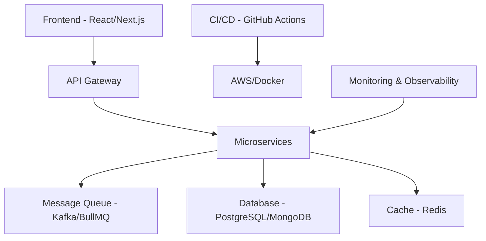

<h1 align="center">Hey 👋, I'm Ghanshyam Singh</h1>
<h3 align="center">🚀 Full Stack Engineer • Indie Hacker • SaaS Builder • OSS Contributor • System Design</h3>

  

  
  
  

  
  
  
   
  

---

## 🚀 About Me

- 🛠 Builder @ [Iron Industry](https://www.iron-industry.tech) — empowering students with next‑gen SaaS tools  
- 🌟 Open‑Source Contributor: **CNCF**, **Apache**, **MifosX**, **GSSoC '24**, **SheBright**, **DevRhylme Foundation** 
- 🏗️ Deep in **System Design**, **DevOps**, **Cloud Architecture** & **CI/CD**  
- 📚 Currently mastering: **Solidity**, **Rust**, **Go**, **C#**, low‑level design, scaling systems  
- 🎯 **2025 Goal**: Launch 3 SaaS startups & contribute to major OSS projects

---

## 🛠️ Tech Stack & Tools

### Languages

### Frontend & Web Technologies

### Backend & Frameworks

### Databases & Storage

### Cloud Platforms & DevOps

### Containerization & Orchestration

### CI/CD & DevOps Tools

### Deployment Platforms

### Version Control & Collaboration

### Development Tools & IDEs

### Design & Prototyping

### Web3 & Blockchain

### Message Queues & Event Streaming

### Monitoring & Analytics

### Operating Systems

### Package Managers

## 🏆 Featured Projects & Creations

| Project | Tech Stack | Description | Status |
|---------|------------|-------------|--------|
| **[AlumConn](https://alumconn.in/)** | React, Node.js, PostgreSQL | SaaS platform for verified student‑alumni mentoring | 🚀 Live |
| **[Homie Finder](https://github.com/ghanshyam2005singh/Task-Manager)** | Next.js, Supabase, TailwindCSS | Trustworthy roommate & PG finder with social verification | 🚀 Live |
| **[CV Slayer](https://github.com/ghanshyam2005singh/CV-Slayer)** | React, OpenAI API, Node.js | AI‑powered CV review app with three levels of sass | 🚀 Live |
| **[Padh-le-Bhai](https://padh-le-bhai-one.vercel.app/)** | MERN Stack, Material-UI | Community‑powered academic resource hub | 🚀 Live |
| **[Zombie Survival Shooter](https://github.com/ghanshyam2005singh/Zombie-Survival-Shooter)** | Phaser3, Firebase | Game with Firebase scoring engine | 🎮 Game |
| **[Voting-App](https://github.com/ghanshyam2005singh/Voting-App)** | Solidity, Web3, Base | Web3 recharge dApp using Solidity on Base Sepolia | ⛓️ Web3 |
| **[Task Manager](https://github.com/ghanshyam2005singh/Task-Manager)** | MERN, JWT, Material-UI | Full‑stack to‑do app with authentication | 📱 App |
| **[Dev Env Backup](https://github.com/ghanshyam2005singh/script-for-backup-the-data)** | Shell Scripts, Node.js | One‑click dev‑environment backup & restore scripts | 🛠️ Tool |

---

## 🏗️ System Design & Scalability Expertise

**Architecture Patterns I Use:**
- 🏗️ **Microservices** + Event‑Driven Architecture (Kafka, WebSocket, Firebase Streams)  
- 📦 **Monorepo DX** powered with Nx + Turbo  
- ⚡ **Performance**: Rate‑limiters, queues, caching (Redis, BullMQ, SQS)  
- 🔐 **Security**: API Gateways, Auth flows, JWT, OAuth  
- 📊 **Observability**: Logging, monitoring, CI/CD pipelines  

---

## 📊 GitHub Analytics

  
  

  

  

---

## 🏆 Achievements & Recognition

  

**Open Source Contributions:**
- 🌟 **CNCF** - Active contributor to multiple repositories
- 💪 **SheBright** - Supporting women in tech initiatives
- 🏗️ **DevRhylme Foundation** - Building developer tools
- 💰 **Apache** - Platform contributions

---

## 🎯 Vision 2025

| Goal | Status | Timeline |
|------|--------|----------|
| 🚀 Launch 3 SaaS Startups | 🟡 In Progress | Q1-Q4 2025 |
| 📚 System Design Resources | 🟡 Planning | Q2 2025 |
| 🤖 AI/ML Integration | 🟡 Research | Q3 2025 |
| 📖 Dev Journey Documentation | 🟢 Active | Ongoing |

---

## 🎨 Fun Facts & Interests

- 🎮 **Gaming**: Love building games with Phaser3 and exploring game mechanics
- ☕ **Coffee Enthusiast**: Best code is written with perfect coffee
- 🎵 **Music**: Coding playlist includes lo-fi, electronic, and classical
- 📚 **Learning**: Always exploring new tech - currently diving deep into Rust & Solidity
- 🌱 **Sustainability**: Building tech that makes a positive impact

---

  

  
**"Code the infrastructure others just conceive."**  
*— Ghanshyam Singh*

 

*Thanks for visiting! Let's connect and build something amazing together!* 🚀

