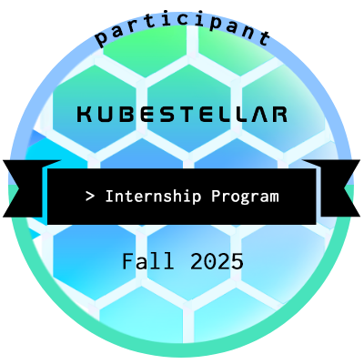
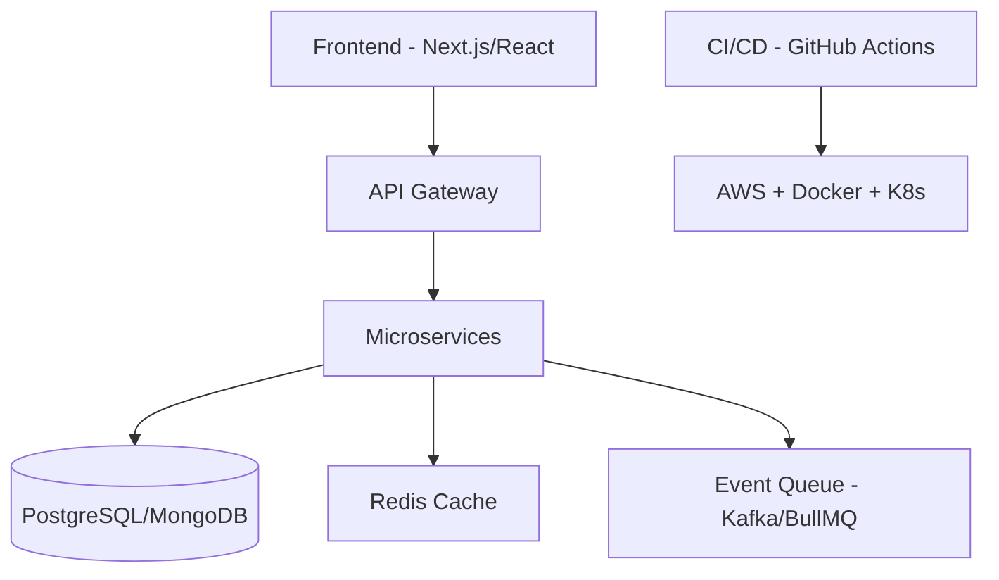

<h1 align="center">👋 Hey, I'm <strong>Ghanshyam Singh</strong></h1>
<h3 align="center">🚀 Full Stack Engineer • AI & DevOps Enthusiast • Indie Hacker • OSS Contributor</h3>

  

  
  
  

  
  
  
  

---

# 🧩 **About Me**

* 🛠 Full Stack Engineer → building SaaS tools like **[AlumConn](https://alumconn.in)**
* 🤝 Open Source Contributor → **CNCF**, **Kubestellar**, **Apache**, **GSSoC**, **SheBright**, **DevRhylme Foundation**
* 🤖 Exploring **Agentic AI**, **LLMs**, infra automation & intelligent developer tools
* 🏗 Skilled in **system design**, **DevOps**, **Cloud**, **CI/CD**, **scalable backend architecture**
* 🌱 Currently leveling up in:

  * Agentic AI systems (planning, RAG, tool-use)
  * Distributed systems & microservices
  * Rust, Go & low-level engineering

---

# 🏅 **Internship & Work Experience**

### 🔹 **CNCF – Kubestellar (Multi-Cluster Management Ecosystem)**

**Role:** Open Source Intern — Agentic AI & Documentation Engineering
**Duration:** Sep 2025– Nov 2025

**Highlights:**

* Developed **Agentic AI features** for Kubestellar
* Built **AI-powered documentation chatbot** for users
* Improved documentation website (UI + content architecture)
* Raised **20+ PRs**, reviewed **21 PRs**, solved critical issues

---

# 🚀 **Tech Stack**

### 💻 **Languages**

TypeScript • JavaScript • Python • Go • C++ • Java • C • C# • Rust (learning)

### 🧩 **Frontend**

React • Next.js • Angular • TailwindCSS • MUI • HTML • CSS

### ⚙️ **Backend & API**

Node.js • Express • FastAPI • .NET • WebSockets • REST • GraphQL (basics)

### 🗄 **Databases**

PostgreSQL • MongoDB • Redis • Supabase • Firebase • DynamoDB • Prisma

### ☁️ **Cloud & DevOps**

AWS • GCP • Docker • Kubernetes • Kubestellar • GitHub Actions • GitLab CI/CD

### 🧰 **Other Tools**

Linux • WSL2 • Git • Vercel • Railway • Render

---

# ⭐ **Featured Projects**

| Project                              | Stack                       | Description                                |
| ------------------------------------ | --------------------------- | ------------------------------------------ |
| **[AlumConn](https://alumconn.in/)** | React, Node, PostgreSQL     | SaaS for verified alumni–student mentoring |
| **Homie Finder**                     | Next.js, Supabase, Tailwind | Social-verified roommate/PG finder         |
| **[CV Slayer](https://cv-slayer-ppnn.onrender.com/)**                        | React, Node, OpenAI API     | AI-powered CV reviewer with sass modes     |
| **[Padh-le-Bhai](https://padh-le-bhai-one.vercel.app/)**                     | MERN, MUI                   | Community academic resources platform      |
| **Dev Env Backup**                   | Shell • Node                | One-click dev environment backup script    |

---

# 🏗️ **System Design & Architecture**

**I work with:**

* Microservices • Event-Driven Systems
* High-availability, caching, load-balancing
* Auth systems (JWT, OAuth, RBAC)
* DevOps pipelines & infra automation

---

## 📊 GitHub Analytics

  
  

  

  

---

### 💬 “Code the infrastructure others just conceive.”

**— Ghanshyam Singh**

